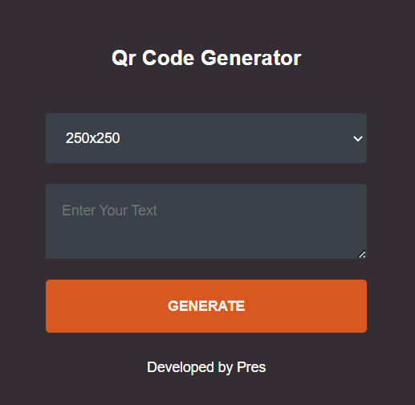

# QR Code Generator

This is a simple QR Code Generator application built with JavaScript. It allows users to generate QR codes based on the text input and select the size of the QR code image.

## Features

- Generate QR codes of different sizes: 100x100, 150x150, 200x200, 250x250, and 300x300 pixels.
- Input text can be customized by the user.
- User-friendly interface with a clean and minimal design.

## Usage

1. Clone the repository or download the source code files.

2. Open the `index.html` file in a web browser.

3. Fill in the text you want to convert into a QR code in the "Enter Your Text" textarea.

4. Select the desired size for the QR code from the dropdown menu.

5. Click the "Generate" button to generate the QR code.

6. The generated QR code image will be displayed below the button.

### How it Looks ... 

## Dependencies

- This project doesn't have any external dependencies. It uses pure HTML5, CSS, and JavaScript to generate QR codes.

## Contributing

Contributions are welcome! If you have any suggestions, bug fixes, or improvements, please open an issue or submit a pull request.

## License

This project is licensed under the [MIT License](LICENSE).

## Acknowledgements

- The QR code generation functionality is implemented using the [Google Chart API](https://developers.google.com/chart/infographics/docs/qr_codes).
- The project structure and code organization are inspired by best practices and clean code principles.

## Contact

For any inquiries or questions, please feel free to reach out to [prestonnyamweya@gmail.com](mailto:prestonnyamweya@gmail.com).

## Stats

